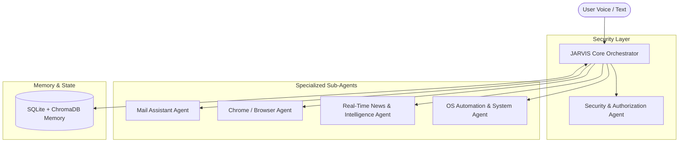

# AGENTS.md - Multi-Agent Architecture & Operational Guide

## 1. Overview
This document specifies the autonomous multi-agent architecture powering **Project JARVIS**. It outlines the responsibilities, tool access boundaries, permission models, and collaboration protocols across all specialized sub-agents.

---

## 2. Multi-Agent Ecosystem

The system follows a **Hierarchical Orchestrator-Worker** design pattern:

---

## 3. Sub-Agent Roles & Responsibilities

### 3.1 JARVIS Core Orchestrator
- **Model**: Google Gemini Pro / Flash (`gemini-2.5-flash` / `gemini-2.5-pro`).
- **Role**: Intent recognition, workflow planning, routing commands to specialized sub-agents, synthesizing multi-tool responses into concise voice replies.
- **Context Management**: Injects user preferences, recent conversation history, and relevant semantic memories.

### 3.2 Security & Authorization Agent (`SecurityAgent`)
- **Role**: Validates every incoming voice/text request against security policies and guards system unlock state.
- **Voice Security Code Protocol**:
  - **Wake & Boot Lock**: JARVIS launches in a locked state. Nobody can query or command JARVIS without speaking the configured **Voice Security Passphrase** (e.g., *"Authorization Code Omega Nine"*).
  - **Voice Passphrase Verification**: Speech is converted to text, normalized, and compared against a secure salted hash.
  - **Dynamic Voice Lockout**: 3 failed passphrase attempts triggers a 60-second cooldown with audible alert.
  - **Action Elevation**: High-risk actions (e.g. sending emails via `sanesrujan84@gmail.com`, disk write/delete, browser logins) enforce immediate voice code re-confirmation.
  - **Credential Isolation**: All API keys, passwords, and tokens are stored exclusively in `.env` (strictly gitignored). No raw credentials or email passwords ever enter source control or Git history.
- **Protected Actions**: System unlock, sending emails, launching non-whitelisted executables, browser automated submissions.

### 3.3 Mail Assistant Agent (`MailAgent`)
- **Role**: Full mailbox management via secure IMAP/SMTP and/or Gmail API.
- **Capabilities**:
  - `fetch_unread_emails(limit=5)`: Summarizes sender, subject, and key points.
  - `search_emails(query)`: Semantic and keyword search across local mail cache.
  - `draft_email(recipient, subject, body)`: Prepares email for review.
  - `send_email(draft_id)`: **[RESTRICTED]** Requires security passcode before dispatch.

### 3.4 Chrome & Web Automation Agent (`ChromeAgent`)
- **Role**: Automated web navigation, research, and interaction using Playwright / CDP.
- **Capabilities**:
  - `open_url(url)`: Launches and navigates to target pages.
  - `search_google(query)`: Performs web searches and extracts key snippets.
  - `summarize_page(url)`: Scrapes readable text and generates executive summaries.
  - `click_and_fill(selector, text)`: **[RESTRICTED]** For authenticated portal automation.

### 3.5 News & Real-Time Intelligence Agent (`NewsAgent`)
- **Role**: Aggregates breaking news, technology trends, weather, and market updates using free feeds.
- **Capabilities**:
  - `get_top_headlines(category)`: Fetches live news from RSS feeds and DuckDuckGo News.
  - `get_weather(city)`: Real-time weather and forecast data.

### 3.6 System Automation Agent (`SystemAgent`)
- **Role**: Desktop environment management and hardware telemetry.
- **Capabilities**:
  - `get_system_metrics()`: CPU usage, RAM consumption, battery levels, disk health.
  - `open_application(app_name)`: Launches desktop applications (e.g., Notepad, VS Code).
  - `control_media(action)`: Play/pause, volume control, mute.

---

## 4. Permission & Security Matrix

| Action | Agent | Permission Level | Verification Method |
| :--- | :--- | :--- | :--- |
| Read emails / summarize inbox | `MailAgent` | Standard | None (Public read) |
| Send an email | `MailAgent` | **Elevated** | **Secret Voice Code / PIN** |
| Web search & read articles | `ChromeAgent` | Standard | None |
| Browser form submission / login | `ChromeAgent` | **Elevated** | **Secret Voice Code / PIN** |
| Get system telemetry (CPU/RAM) | `SystemAgent` | Standard | None |
| Launch / kill OS processes | `SystemAgent` | **Elevated** | **Secret Voice Code / PIN** |
| Get breaking news & weather | `NewsAgent` | Standard | None |

---

## 5. Memory Architecture

1. **Short-Term Working Memory**:
   - In-memory conversation buffer maintained during the active session.
   - Cleansed on agent reset.

2. **Long-Term Relational Memory (SQLite)**:
   - Stores user preferences, authorization hash, command audit trails, and tool execution logs.
   - Accessible via SQLAlchemy repository interfaces.

3. **Long-Term Vector Memory (ChromaDB / SQLite-Vec)**:
   - Embeds notes, emails, and important past dialogues using Gemini embeddings.
   - Enables semantic queries (e.g., *"Jarvis, what was the email I received about the project deadline last week?"*).

---

## 6. Development & Extension Guidelines
- Every new sub-agent must inherit from `BaseAgent` in `src/agents/base.py`.
- Any tool capable of state modification or external communication must register with `@require_authorization`.
- Zero paid dependencies: Use only open-source or free-tier APIs (Google Gemini Free Tier, Edge-TTS, Playwright, DuckDuckGo).
