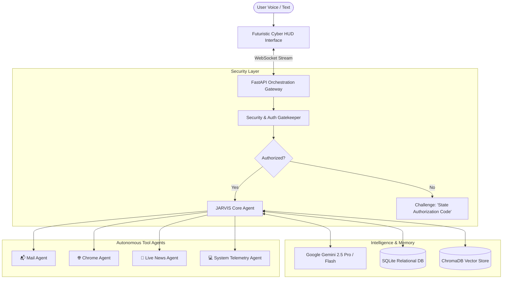

# 🤖 JARVIS: Next-Gen Autonomous AI Assistant

[](https://www.python.org/downloads/)
[](https://fastapi.tiangolo.com)
[](https://ai.google.dev/)
[](https://playwright.dev/)
[](https://opensource.org/licenses/MIT)
[](https://github.com/psf/black)

> **JARVIS** (*Just A Rather Very Intelligent System*) is a production-grade, voice-controlled, multimodal AI assistant designed for desktop automation, proactive intelligence, and personal task management. Built with a modular multi-agent architecture powered by **Google Gemini**, it features real-time voice interaction, browser automation, secure email management, and zero-cost local persistence.

---

## 🌟 Key Highlights

- 🎙️ **Voice-First Interaction**: High-fidelity, ultra-natural neural speech synthesis via `edge-tts` paired with low-latency speech recognition.
- 🛡️ **Secret-Code Security Gate**: Enterprise-grade authorization protocol requiring a secret voice passphrase or PIN before executing sensitive actions (sending emails, system commands, account access).
- 🌐 **Autonomous Chrome & Browser Agent**: Powered by Playwright for live web scraping, automated navigation, dynamic page interaction, and research synthesis.
- 📬 **Full Mailbox Management**: Read, summarize, triage, draft, and dispatch emails with IMAP/SMTP and Gmail integrations.
- 🧠 **Dual-Tier Memory System**:
  - **Relational Store (SQLite)**: Lightning-fast structured storage for configuration, audit logs, and task queues.
  - **Vector Semantic Store (ChromaDB)**: Embedded vector memory enabling natural semantic recall over past conversations, notes, and emails.
- ⚡ **Futuristic Cyber-HUD Dashboard**: Sleek Iron Man-inspired glassmorphism web interface with real-time reactive audio visualizer, live agent reasoning logs, and quick-action command cards.
- 💸 **100% Free Stack**: Built entirely on free-tier APIs and open-source local engines. Zero subscription costs.

---

## 🏗️ System Architecture



---

## 🚀 Quick Start Guide

### Prerequisites
- **Python 3.11+** installed
- **Git**
- Free **Google Gemini API Key** (from [Google AI Studio](https://aistudio.google.com/))

### 1. Clone the Repository
```bash
git clone https://github.com/srujan-sane-27/Jarvis.git
cd Jarvis
```

### 2. Set Up Virtual Environment
```bash
python -m venv venv

# Windows
venv\Scripts\activate

# macOS / Linux
source venv/bin/activate
```

### 3. Install Dependencies
```bash
pip install -r requirements.txt
playwright install chromium
```

### 4. Configure Environment Variables
Create a `.env` file in the root directory:
```env
# AI Model Configuration
GEMINI_API_KEY=your_gemini_api_key_here
GEMINI_MODEL=gemini-2.5-flash

# Security & Voice Authorization
# Secret passphrase required to unlock Jarvis via voice or authenticate actions
JARVIS_SECRET_CODE=omega-protocol-9
SESSION_TIMEOUT_MINUTES=10

# Dedicated Agent Automation Email (Kept strictly local in .env)
EMAIL_USER=sanesrujan84@gmail.com
EMAIL_APP_PASSWORD=your_gmail_app_password
EMAIL_IMAP_SERVER=imap.gmail.com
EMAIL_SMTP_SERVER=smtp.gmail.com

# Server Settings
PORT=8000
HOST=127.0.0.1
```

### 5. Launch JARVIS
```bash
python -m src.main
```
Open your browser and navigate to `http://localhost:8000` to interact with the **JARVIS Cyber HUD**.

---

## 📂 Project Structure

```
Jarvis/
├── .gitignore               # Comprehensive ignores for env, cache, and binaries
├── AGENTS.md                # Multi-agent architecture specification & guidelines
├── README.md                # Project documentation and portfolio showcase
├── requirements.txt         # Core dependencies
├── src/
│   ├── __init__.py
│   ├── main.py              # Application entrypoint & FastAPI gateway
│   ├── config.py            # Typed settings & environment management
│   ├── agents/              # Sub-agent implementations
│   │   ├── __init__.py
│   │   ├── base.py          # Abstract agent base class
│   │   ├── orchestrator.py  # Central Gemini-powered brain
│   │   ├── mail_agent.py    # Email triage and sending tool
│   │   ├── chrome_agent.py  # Playwright browser controller
│   │   ├── news_agent.py    # Real-time RSS & web intelligence
│   │   └── system_agent.py  # Hardware metrics and app launcher
│   ├── voice/               # Speech-to-Text & Text-to-Speech
│   │   ├── tts.py           # Edge-TTS neural speech engine
│   │   └── stt.py           # Speech recognition pipeline
│   ├── security/            # Passcode verification and encryption
│   │   ├── auth.py          # Passcode validator & session elevated state
│   │   └── audit.py         # Security event logger
│   ├── database/            # Persistence layer
│   │   ├── models.py        # SQLAlchemy relational schemas
│   │   ├── session.py       # Async SQLite database session
│   │   └── memory.py        # ChromaDB / SQLite-vec semantic memory
│   └── ui/                  # Futuristic Cyber-HUD Frontend
│       ├── index.html       # HUD web dashboard
│       ├── css/
│       │   └── hud.css      # Dark glassmorphism & glowing cyber styles
│       └── js/
│           ├── app.js       # WebSocket client & action dispatcher
│           └── visualizer.js# Web Audio API reactive waveform canvas
└── tests/                   # Automated unit & integration tests
```

---

## 🔒 Security & Privacy Architecture

1. **Least-Privilege by Design**: Standard read queries never trigger authorization. Any action with side-effects (e.g., sending emails, executing shell commands, or browser form actions) requires explicit authorization.
2. **Zero Plaintext Secrets**: Passcodes are hashed using bcrypt before comparison. Secrets and credentials stay on your local machine.
3. **No Unapproved Third-Party Clouds**: Conversations and local memories are stored on your local disk in SQLite and ChromaDB.

---

## 💼 Portfolio Showcase & Industry Best Practices

This project demonstrates proficiency in:
- **Agentic AI & LLM Tool Calling**: Leveraging Gemini function calling for autonomous multi-step reasoning.
- **Asynchronous Python**: Non-blocking I/O using `asyncio`, `FastAPI`, and `Playwright`.
- **Full-Stack Engineering**: Microservice architecture connecting Python backends to a responsive HTML5/CSS3/JS HUD via WebSockets.
- **Clean Architecture & Design Patterns**: Dependency injection, repository pattern, and modular sub-agent isolation.

---

## 👤 Author

- **Name**: Srujan Sane
- **GitHub**: [@srujan-sane-27](https://github.com/srujan-sane-27)
- **Email**: [srujansane27@gmail.com](mailto:srujansane27@gmail.com)

---

## 📄 License
This project is licensed under the MIT License - see the LICENSE file for details.
